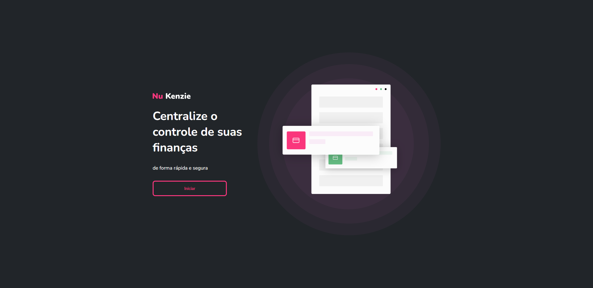
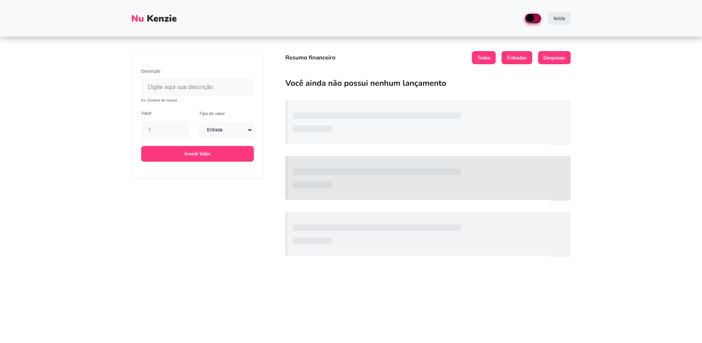
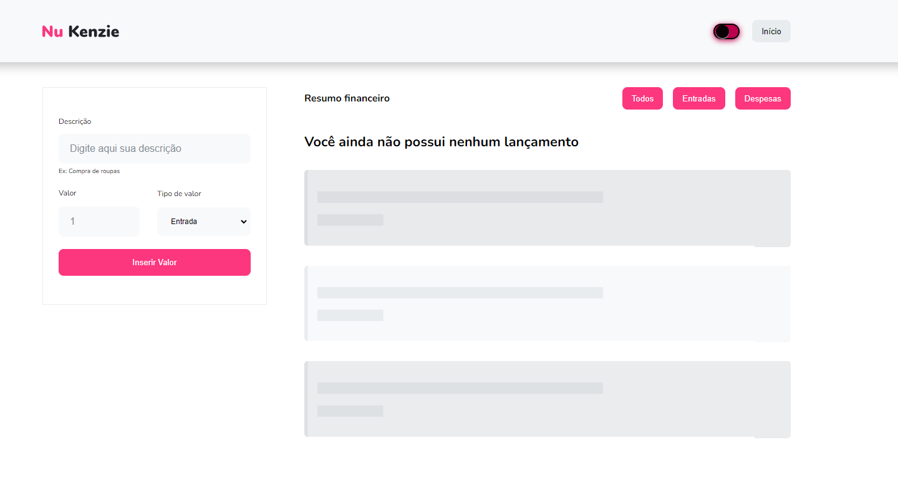
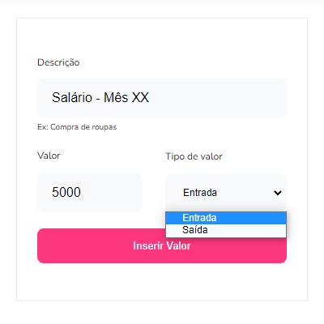
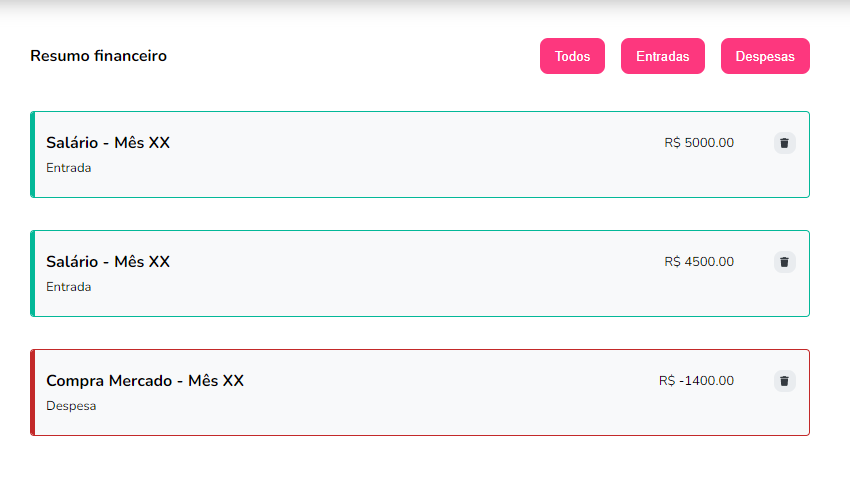
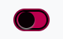
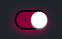
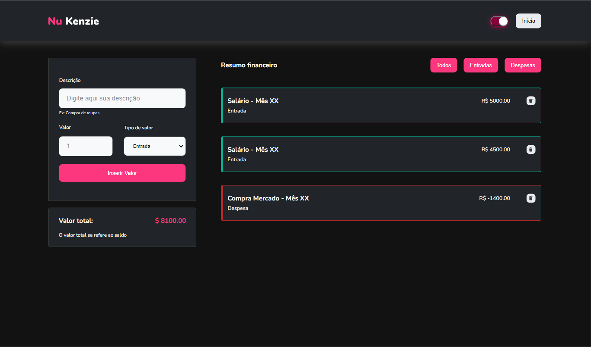

<cite>For README in english, <strong><a href="./README.md">click here</a></strong></cite>

<h2>Pré Visualização</h2>

    <table>
    <tr>
        <td></td>
        <td></td>
    </tr>
</table>

 

<h1>Sobre</h1>

Nu Kenzie é uma aplicação que visa centralizar o controle de suas finanças. A aplicação permite que o usuário insira um card com a descrição e o valor da movimentação econômica, seja ela de entrada ou saída. Existe também um filtro para mostrar somente as despesas ou entradas.

 

<h2>Estruturação do Projeto e Tecnologias</h2>

Nu Kenzie é uma simples aplicação e minha primeira experiência inicial com <strong>React</strong> em termos de projeto. Nele foram utilizados conceitos de <strong>React Hooks</strong>, <strong>Renderização Condicional</strong> e <strong>Componentização</strong>.

  

<h3>Tecnologias / Bibliotecas</h3>
<ul>
    <li>React</li>
    <li>React-Toastify</li>
    <li>Styled-Components</li>
    <li>UuidV4</li>
</ul>

 

<h2>Como Funciona</h2>

 
<table>
    <tr>
        <td width="50%"></td>
        <td>
No lado esquerdo você encontra o painel para adicionar suas finanças. No exemplo ao lado, inserimos uma descrição, o valor, e o tipo de movimentação financeira (Entrada ou Despesa). Após o preenchimento completo, clique em <strong>Inserir Valor</strong> para a movimentação financeira aparecer na aba de <strong>Lançamentos</strong>.
</td>
    </tr>
</table>

 

 

    
    
Na parte mais centralizada temos a aba do <strong>Resumo Financeiro</strong> onde conseguimos ver todas as nossas movimentações. Aqui podemos filtrar entre Entradas ou Despesas e excluir alguma movimentação.

 

<h2>Funcionalidades Extras</h2>

<h3>Modo Escuro</h3>

    
    
     
    

 

<h3>Personalização do Usuário e Local Storage</h3>

A aplicação salva as definições do usuário e suas movimentações no Local Storage do navegador, deixando-a mais consistente e "real".

 

<h2>Link do Projeto: <a href="https://nu-kenzie-delta.vercel.app/" target="blank_">Nu Kenzie</a></h2>
