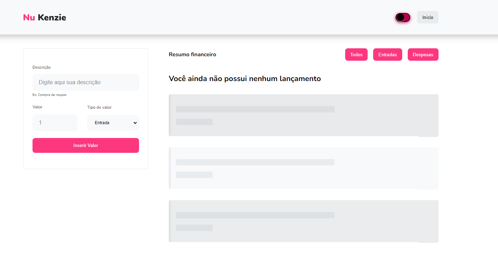
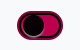
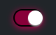
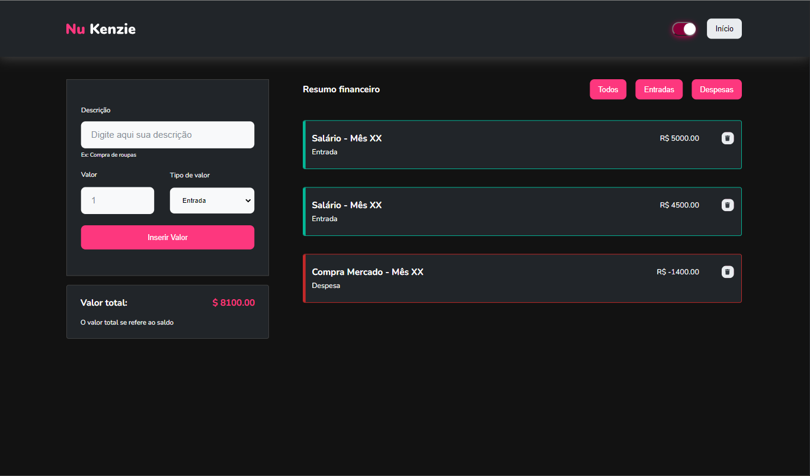

<cite>Para README em Português, <strong><a href="./README-ptbr.md">clique aqui</a></strong></cite>

<h2>Preview</h2>

<table>
    <tr>
        <td></td>
        <td></td>
    </tr>
</table>

 

<h1>About</h1>

Nu Kenzie is an application that aims to centralize the control of your finances. The application allows the user to insert a card with the description and value of the economic movement, be it earnings or expense. There is also a filter to show only expenses or earnings.

 

<h2>Project Structuring and Technologies</h2>

Nu Kenzie is a simple application and my first initial experience with React in terms of project. It used concepts of <strong>React Hooks</strong><strong>Conditional Rendering</strong>, and <strong>Componentization</strong>.

  

<h3>Technologies / Libraries</h3>
<ul>
    <li>React</li>
    <li>React-Toastify</li>
    <li>Styled-Components</li>
    <li>UuidV4</li>
</ul>

 

<h2>How it Works</h2>

 
<table>
    <tr>
    <td width="50%"></td>
    <td>
On the left side you can find the panel to add your finances. In the example on the side, we insert a description, the amount, and the type of financial transaction (Earnings or Expenses). After filling it out completely, click <strong>Insert Amount</strong> for the financial transactions to appear on the <strong>Transactions tab</strong>.
</td>
    </tr>
</table>

 

 

    
    
In the most centralized part we have the <strong>Financial Summary</strong> tab where we can see all our movements. Here we can filter between Income or Expenses and exclude some movement.

 

<h2>Extras Features</h2>

<h3>Darkmode</h3>

    
    
     
    

 

<h3>User Costumization and Local Storage</h3>

The application saves the user's definitions and their movements in the browser's Local Storage, making it more consistent and "real".

 

<h2>Link of Project: <a href="https://nu-kenzie-delta.vercel.app/" target="blank_">Nu Kenzie</a></h2>
